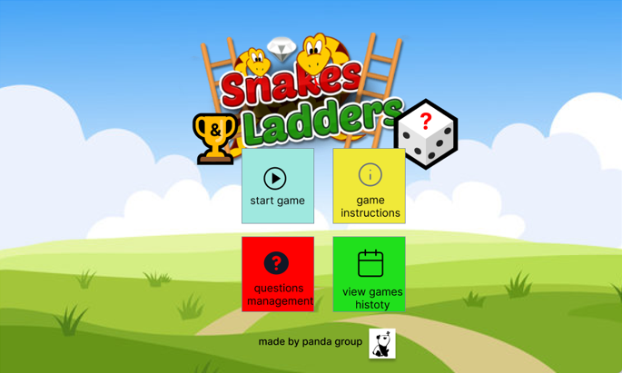
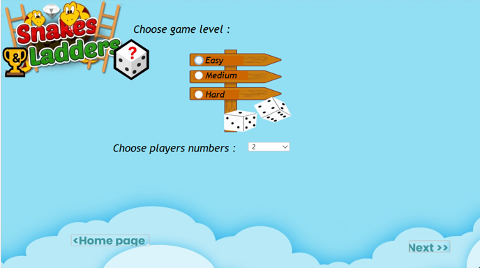
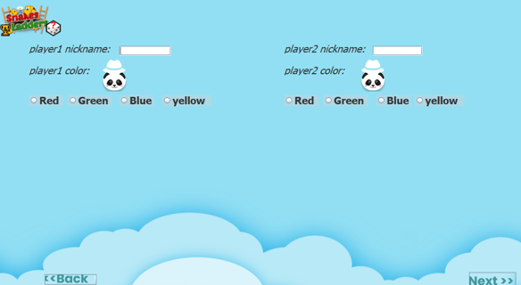
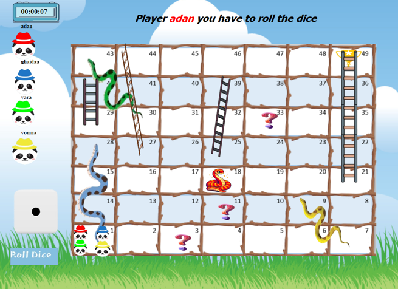

# 🐍🎲 Snakes and Ladders – Java Game
<div align="center">
  
</div>

## 📄 Description

This is a fully-featured desktop application of the classic **Snakes and Ladders** game developed in Java. It includes multiple game difficulty levels, a custom question engine with a question manager, player color and name customization, real-time board interaction, and full support for random game elements.

The game is built with **Java Swing** for GUI and supports 2 to 4 players. A built-in **admin panel** allows modifying questions stored in a JSON file. Gameplay data is stored in CSV for history tracking.

---

## 🚀 Gameplay Flow

1. **Main Menu** — Navigate to the following options:
   - Start Game
   - Instructions
   - Question Management (Admins only)
   - View History

2. **Start Game**  
   - Choose number of players (2–4, default: 2)
   - Select game difficulty: Easy, Medium, or Hard
   - If no difficulty is selected, an error message is shown
   - Proceed to enter nickname and pick a unique color for each player

3. **Game Setup**  
   - Players must choose a unique nickname and color
   - Colors chosen are disabled for other players
   - When all data is valid → proceed to game board

4. **Game Board**  
   - Board size and logic change by difficulty:
     - Easy: 7×7
     - Medium: 10×10
     - Hard: 13×13
   - Board is randomized each time
   - Snakes, ladders, question squares, and surprise tiles are placed according to the rules of each difficulty

5. **Dice Roll**  
   - Dice includes actions like: stay, move 1–6 steps, get a question (Easy/Medium/Hard)
   - When a player lands on a question tile or dice lands on a question side, a random question from the JSON file is shown

6. **Game Logic**  
   - Answering a question wrong/right affects movement
   - Constraints include: no special tiles on start/end, no duplicate heads of snakes on one tile, etc.

7. **Game End**  
   - Winning player is shown with animation and music
   - Player stats and timer are recorded

8. **Instructions**  
   - Display full how-to-play guide

9. **Admin Question Panel**  
   - Login required (username/password)
   - View questions (from JSON), edit, delete, or add new
   - Changes persist in the JSON file

10. **History**  
   - History stored in a `.csv` file
   - Highlights row when selected

---

## 🧩 Features

- 🎮 Multiple difficulty levels with changing board mechanics
- 🧠 JSON-based question challenges with 3 difficulty tiers
- 🧪 Real-time validation, player color and nickname uniqueness
- 🎲 Custom dice logic with various gameplay outcomes
- 🗂️ Game history saved as CSV
- 👨‍💻 Admin-only question management panel
- 🎨 Color-coded UI with visual player cues
- 🎼 End-game music and victory animation

---

## ⚙️ Tech Stack

- **Language:** Java  
- **GUI:** Swing  
- **Data:** JSON (questions), CSV (history)  
- **Build Tool:** Ant (`build.xml`)  
- **IDE:** NetBeans (project contains `.nbproject`)

---

## 🗂️ src/ Project Structure
```bash
src/
├── Controller/
│   ├── FieldIsNull.java
│   ├── Main.java
│   ├── Screenshot.java
│   ├── SysData.java
│   └── UnvalidExceptions.java
│
├── Enum/
│   ├── Levels.java
│   ├── PlayerColor.java
│   └── SnakeColor.java
│
├── FlatLafDesign/
│   ├── ActionButton.java
│   ├── AudioButton.java
│   ├── BackButton.java
│   ├── FlatLaf.properties
│   ├── History.form
│   ├── PanelAction.form
│   ├── PanelAction.java
│   ├── RoundedBorder.java
│   ├── TableActionCellEditor.java
│   ├── TableActionCellRender.java
│   ├── TableActionEvent.java
│   └── TableGradientCell.java
│
├── Model/
│   ├── Admin.java
│   ├── Audio/
│   │   └── PlayAudio.java
│   ├── Board.java
│   ├── Dice.java
│   ├── DiceFactory.java
│   ├── EasyDice.java
│   ├── Game.java
│   ├── Ladder.java
│   ├── MidDice.java
│   ├── MovePlayerTemplate.java
│   ├── Player.java
│   ├── Question.java
│   ├── QuestionSquare.java
│   ├── Snake.java
│   ├── Square.java
│   └── SurpriseSquare.java
│
└── View/
    ├── img/                         # (Folder for image assets)
    ├── EasyLevel.java
    ├── FlatLaf.properties
    ├── GifExample.java
    ├── HardLevel.java
    ├── History.java
    ├── Instructions.java
    ├── InterPlayersInfoFrame.java
    ├── LevelGame.java
    ├── LogIn.java
    ├── MainFrame.java
    ├── MediumLevel.java
    ├── QuestionAnswers.java
    ├── QuestionFrame.java
    ├── Winner.java
    └── addQuestion.java
```
## 🖼️ Screenshots

### 🏠 Game Home & Level Selection
<div>
  
  
</div>

---

### 🧍‍♂️ Player Setup
<div>
  
</div>

---

### 🎲 Game Board & In-Game Instructions
<div>
  
  
</div>

---

### ❓ Question Popup & Info
<div>
  
  
</div>

---

### 🛠️ Admin Panel & Add Question
<div >
  
  
</div>

---

### 🏁 Game Winner Screen
<div >
  
</div>


# ▶️ How to Run

1. Open the project in **NetBeans** or your preferred IDE.
2. Build the project using `build.xml` (Ant).
3. Run `Main.java` or use the generated JAR file.

> 🗂️ Double-click the JAR file to launch the game directly.

---

## 🙌 Credits

- Developed by Team Panda  (our team)
- Graphics & UI Styling: [FlatLaf](https://www.formdev.com/flatlaf/)  
- All logic and backend implemented from scratch  
- Questions and history stored and managed with JSON & CSV
